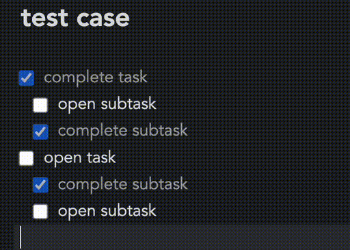

# Suitcase 🧳

This Joplin plugin adds text **capitalization** options to the Markdown and rich text editors, as well as allows to **sort** lines in a **case-insensitive** manner.

The plugin is also available on **mobile** version of Joplin.
### 🔠 Capitalization options 

In the menu `Edit --> Capitalization` you will find many commands that can be applied after selecting text:

- lower case
- UPPER CASE
- Title Case
- Sentence case
- ｆｕｌｌｗｉｄｔｈ
- halfwidth
- lower case no connecting characters
- UPPER CASE NO CONNECTING CHARACTERS
- camelCase
- kebab-case
- snake_case
- PascalCase
- Pascal_Snake
- dot.case
- path/case
- CONSTANT_CASE
- Train-Case

Each case can be associated with **keyboard shortcut** in Joplin settings.

### 🛠️ All In One Command
**Swap Case** command cycles through all capitalization options when sequentially executed on selected text.

**Swap Case** command can be associated with **keyboard shortcut** in Joplin settings.

**Settings** allow you to configure Swap Case command. You can:
- **re-order** capitalization options;
- **disable** capitalization options.

Only the following options are enabled by **default**: lower case, UPPER CASE, Title Case & Sentence case.

### 🔤 Sort Lines in a Case-Insensitive, Block-Aware Manner

You can sort lines of selected text in a case-insensitive manner through the right-click option, from the Edit menu, or by calling the command (`Cmd/Ctrl + Alt + Shift + A`).

By default the sorter keeps indented lines attached to their parent, so nested bullets or subtasks move as one unit:

Prefer a strict line-by-line sort? Disable **Sort indented lines as blocks** in the Suitcase settings section.

Command can be associated with **keyboard shortcut** in Joplin settings.

#### Example

| Original Text | Case-Sensitive Sort | Case-Insensitive Sort (Suitcase) |
|---------------|---------------------|----------------------------------|
| banana        | Apple               | Apple                            |
| Apple         | Banana              | apple                            |
| carrot        | Carrot              | banana                           |
| apple         | apple               | Banana                           |
| Banana        | banana              | carrot                           |
| Carrot        | carrot              | Carrot                           |

### 📝 More Info

[Release notes](CHANGELOG.md)

### 📦 Dependencies

**String transformation**. Huge thanks to Blake Embrey (@blakeembrey):
- [`change-case`](https://www.npmjs.com/package/change-case) – [GitHub](https://github.com/blakeembrey/change-case/tree/main/packages/change-case)  
  Transform a string between camelCase, PascalCase, Capital Case, snake_case, kebab-case, CONSTANT_CASE and others.
- [`title-case`](https://www.npmjs.com/package/title-case) – [GitHub](https://github.com/blakeembrey/change-case/tree/main/packages/change-case)  
  Transform a string into title case following English rules.
